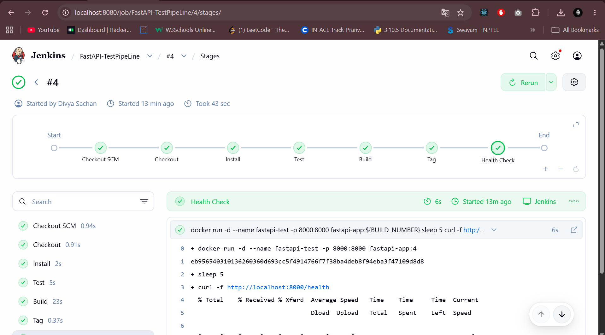

# FastAPI Jenkins CI/CD Mini Project — Summary

## Overview
A simple FastAPI application demonstrating API development, automated testing, Git workflow, Docker containerization, and Jenkins CI/CD automation.

## Project Structure
```
MthreeMiniProject/
│
├── api.py
├── requirements.txt
├── Dockerfile
├── Jenkinsfile
├── README.md
│
└── test/
    └── api_test.py
```

## Requirements
- Python 3
- pip
- Git
- Docker
- Jenkins

## API Endpoints
| Endpoint | Description | Example Response |
|---|---|---|
| `GET /` | Lists all available routes | `{"message": "All routes available", "routes": {...}}` |
| `GET /health` | Health check | `{"status": "Up"}` |
| `GET /version` | App version | `{"version": "1.0.1"}` |
| `GET /environment` | Current environment | `{"environment": "development"}` |

## Setup & Run
```bash
git clone https://github.com/divya16sachan/MthreeMiniProject.git
cd MthreeMiniProject
python3 -m venv venv
source venv/bin/activate      # Windows: venv\Scripts\activate
pip install -r requirements.txt
python3 -m uvicorn api:app --host 127.0.0.1 --port 8000
```
App runs at `http://localhost:8000`.

## Automated Testing
- Uses **pytest** + **requests**
- Test file: `test/api_test.py`
- App must be running before tests execute
- Run: `python3 -m pytest -v test/api_test.py`
- Covers: root endpoint, health, version, environment, 404 on unknown route, content-type check
- Expected result: **6 passed**

## Git Workflow
- Maintain meaningful commit history (`git log --oneline`)
- Check branches (`git branch`) and status (`git status`)
- Standard push flow: `git add . && git commit -m "..." && git push origin main`

## Docker
**Build image:**
```bash
docker build -t fastapi-app:1.0 .
```
**Run container:**
```bash
docker run -d --name fastapi-app -p 8000:8000 fastapi-app:1.0
```

## Externalized Environment Configuration
Pass environment variables via Docker instead of hardcoding:
```bash
docker run -d --name fastapi-app -p 8000:8000 -e APP_ENV=development fastapi-app:1.0
```
Verify: `docker ps` and `curl http://localhost:8000/health`

## Jenkins Pipeline
**Stages:** Checkout → Install → Test → Build → Tag → Health Check

| Stage | Action |
|---|---|
| Checkout | Pulls latest code from GitHub |
| Install | Installs Python dependencies in a venv |
| Test | Runs pytest suite |
| Build | Builds Docker image from Dockerfile |
| Tag | Tags image with Jenkins build number (e.g., `fastapi-app:1`, `:2`, `:3`) |
| Health Check | Starts container, verifies `GET /health` — pipeline fails if this fails |

## Jenkins Job Configuration
- Job type: **Pipeline**
- Pipeline definition: **Pipeline script from SCM**
- SCM: **Git**
- Repository: `https://github.com/divya16sachan/MthreeMiniProject.git`
- Branch: `*/main`
- Script Path: `Jenkinsfile`
- Click **Build Now** to trigger

## Successful Pipeline Output
```
Checkout       SUCCESS
Install        SUCCESS
Test           SUCCESS
Build          SUCCESS
Tag            SUCCESS
Health Check   SUCCESS

Finished: SUCCESS
```

## Verification Checklist
| Area | Requirement | Verification Method |
|---|---|---|
| Application | All 3 endpoints work | Test `/health`, `/version`, `/environment` |
| Git | Required branches + meaningful commits | `git branch`, `git log` |
| Git | Conflict resolved | Git history / merge commit |
| Git | Reviewed pull request | GitHub PR history |
| Testing | At least 2 automated endpoint tests | `pytest -v test/api_test.py` |
| Container | Tagged Docker image runs | `docker images`, `docker ps` |
| Container | Externalized env config | Docker `-e` option |
| Pipeline | Checkout / Install / Test / Build / Tag / Health Check | Jenkins pipeline stages |
| Documentation | New user can run & verify project | Follow README |

## ⚠️ Important Caveats
1. **README alone doesn't satisfy the requirement** that "required branches, a resolved conflict, and a reviewed pull request are visible." These must actually exist in the **GitHub repository's history/PRs** — not just be described in documentation.
2. **Externalized environment configuration** requires the `api.py` code to **actually read** the environment variable at runtime. Simply passing `-e APP_ENV=development` in the Docker run command is **not sufficient** on its own — the application code must consume it.

---
*Note: If you'd like, your actual `api.py`, `Dockerfile`, `Jenkinsfile`, and `api_test.py` can be reviewed against this rubric to confirm these two caveats are properly addressed in code — just share the files.*
